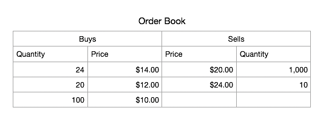

# tzero-fed-take-home
You will be creating a simple trading front-end. The backend order matching engine is already implemented for you (in `./server.js`) and will be called at `http://localhost:3001`, detailed below.  

This is to be completed without consulting others. You may use reference documentation.  

## Install
You need `node.js` and `yarn` installed globally  
`$ yarn # install deps`

## Run
`$ yarn start # run client`  
`$ node server.js # run server`  

Open [http://localhost:3000](http://localhost:3000)  
The page will reload as you make edits.  

## User Stories
Create `<OrderEntry />` and `<OrderBook />` components to be imported and rendered in `App.js`. You can use `fetch()` or a package like `axios` for requests.
### `<OrderEntry />`
- Toggle buy/sell button(s)
- Inputs for `price` and `quantity`
- Submit button to POST http://localhost:3001/buy or http://localhost:3001/sell (depending on the toggle) with `price` and `quantity` in the body (values from the inputs)

### `<OrderBook />`
- GET orders
  - http://localhost:3001/book will return `{ [price]: quantity, ... }` of buys and sells that have been POST'd from the Order Entry
  ```javascript
    {
      buys: { 10: 100, 12: 20, 14: 24 },
      sells: { 15: 0, 20: 1000, 24: 10 },
    }
  ```
- Display the Order Book with DESC (by `price`) list of buys and ASC (by `price)` list of sells. Example:

- Refetch orders after every buy and sell POSTs from the Order Entry
- Don't display entry if it has 0 quantity

## Submit solution
When you are finished, send your recruiter a link to your repo. If you run into issues, please contact them.
